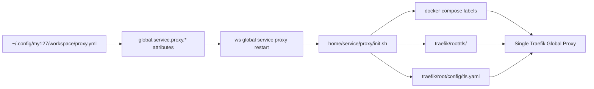

# Custom Global Proxy Domain

Workspace uses `my127.site` by default for local HTTPS hostnames. You can
replace that single Global Proxy domain with another domain by adding a global
Workspace config file on the developer machine.

This feature supports one proxy domain at a time. It does not register multiple
domains.

## Contents

- [How it fits together](#how-it-fits-together)
- [Create the proxy config file](#create-the-proxy-config-file)
- [Host the certificate files](#host-the-certificate-files)
- [Configure DNS](#configure-dns)
- [Apply the change](#apply-the-change)
- [Use the domain in a project](#use-the-domain-in-a-project)
- [Renew certificates](#renew-certificates)

## How it fits together

Workspace automatically loads global config files from:

```text
~/.config/my127/workspace/*.yml
```

Use `proxy.yml` for the proxy override:

```text
~/.config/my127/workspace/proxy.yml
```

`proxy.yml` is a normal Workspace global config file. It is not fetched from a
remote URL and it is not managed by a Workspace import command.



The proxy init script reads these attributes from global Workspace config,
downloads the configured certificate files, and exports the domain for Docker
Compose labels. The source of truth remains the global Workspace config file.

## Create the proxy config file

Minimal `~/.config/my127/workspace/proxy.yml`:

```yaml
attribute('global.service.proxy.domain'): dev.example.test
attribute('global.service.proxy.https.crt'): https://proxy-config.example.internal/certs/dev.example.test/fullchain.pem
attribute('global.service.proxy.https.key'): https://proxy-config.example.internal/certs/dev.example.test/privkey.pem
```

The local certificate filenames default to:

```text
<domain>.crt
<domain>.key
```

For the example above, Workspace writes:

```text
traefik/root/tls/dev.example.test.crt
traefik/root/tls/dev.example.test.key
```

Override the local filenames only when needed:

```yaml
attribute('global.service.proxy.https.crt_file'): proxy.crt
attribute('global.service.proxy.https.key_file'): proxy.key
```

Full example:

```yaml
attribute('global.service.proxy.domain'): dev.example.test
attribute('global.service.proxy.https.crt'): https://proxy-config.example.internal/certs/dev.example.test/fullchain.pem
attribute('global.service.proxy.https.key'): https://proxy-config.example.internal/certs/dev.example.test/privkey.pem
attribute('global.service.proxy.https.crt_file'): dev.example.test.crt
attribute('global.service.proxy.https.key_file'): dev.example.test.key
```

## Host the certificate files

The certificate and key URLs must be reachable from each developer machine when
`ws global service proxy restart` runs.

The files do not need to live beside `proxy.yml`. `proxy.yml` only stores the
URLs where Workspace can download them.

Suggested hosted structure:

```text
proxy-config/
└── certs/
    └── dev.example.test/
        ├── fullchain.pem
        └── privkey.pem
```

GitHub raw URLs work only for public repositories because Workspace does not
authenticate to GitHub. Use public GitHub raw URLs only for disposable test
certificates. Do not publish a real private key in a public repository.

Example public GitHub repository structure:

```text
workspace-proxy-certs/
└── certs/
    └── dev.example.test/
        ├── fullchain.pem
        └── privkey.pem
```

Example `proxy.yml` using GitHub raw URLs:

```yaml
attribute('global.service.proxy.domain'): dev.example.test
attribute('global.service.proxy.https.crt'): https://raw.githubusercontent.com/my-org/workspace-proxy-certs/main/certs/dev.example.test/fullchain.pem
attribute('global.service.proxy.https.key'): https://raw.githubusercontent.com/my-org/workspace-proxy-certs/main/certs/dev.example.test/privkey.pem
```

For organisation/private certificates, use an internal HTTP(S) location that is
reachable from developer machines, such as a private website available on the
company network or VPN.

The certificate must cover the configured domain and the subdomains used by
projects and global services. For `dev.example.test`, the certificate should
cover:

```text
dev.example.test
*.dev.example.test
```

The wildcard covers project hosts and global service hosts such as:

```text
mail.dev.example.test
kibana.dev.example.test
tracing.dev.example.test
```

## Configure DNS

The configured domain and wildcard subdomains must resolve to the developer
machine running the Workspace Global Proxy.

For local development, common options are:

- public DNS records that point the domain and wildcard to `127.0.0.1`;
- private DNS records available only on the organisation network;
- local DNS tools such as Pi-hole, dnsmasq, or `/etc/hosts` for individual
  hostnames.

Wildcard support is recommended because project hostnames are usually generated
under the proxy domain.

## Apply the change

After creating or changing `proxy.yml`, restart the proxy:

```bash
ws global service proxy restart
```

The restart downloads the certificate and key, renders Traefik TLS config, and
recreates the proxy container.

If mail, logger, or tracing are already running, restart those services too so
their Docker labels use the new hostnames:

```bash
ws global service mail enable
ws global service logger enable
ws global service tracing restart
```

## Use the domain in a project

Projects should use the same proxy domain suffix configured globally. For
example:

```yaml
attributes:
  domain: dev.example.test
```

Project hostnames should then be under that suffix, such as:

```text
my-project.dev.example.test
```

This simplified proxy configuration supports one certificate/domain set at a
time. If the proxy is configured for `dev.example.test`, projects still using
`my127.site` may no longer match the active certificate.

## Renew certificates

When a certificate is renewed, keep the hosted certificate URLs stable and
replace the file contents at those URLs.

Then run:

```bash
ws global service proxy restart
```

You only need to edit `proxy.yml` when the domain, certificate URL, key URL, or
local filename changes.
