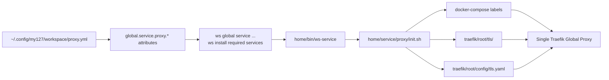

# Custom Global Proxy Domain

Workspace uses `my127.site` by default for local HTTPS hostnames. You can
replace that single Global Proxy domain with another domain by adding a global
Workspace config file on the developer machine.

This feature supports one proxy domain at a time. It does not register multiple
domains.

## Contents

- [How it fits together](#how-it-fits-together)
- [Create the proxy config file](#create-the-proxy-config-file)
- [Host the certificate files](#host-the-certificate-files)
- [Configure DNS](#configure-dns)
- [Apply the change](#apply-the-change)
- [Revert to the default domain](#revert-to-the-default-domain)
- [Use the domain in a project](#use-the-domain-in-a-project)
- [Switch the proxy per project](#switch-the-proxy-per-project)
- [Renew certificates](#renew-certificates)

## How it fits together

Workspace automatically loads global config files from:

```text
~/.config/my127/workspace/*.yml
```

Use `proxy.yml` for the proxy override:

```text
~/.config/my127/workspace/proxy.yml
```

`proxy.yml` is a normal Workspace global config file. It is not fetched from a
remote URL and it is not managed by a Workspace import command.



The internal `ws-service` wrapper resolves proxy attributes before it calls a
service `init.sh`. For the proxy service it exports the domain and certificate
settings; for the other global services it exports the domain used by Docker
Compose labels. The source of truth remains Workspace config.

## Create the proxy config file

Minimal `~/.config/my127/workspace/proxy.yml`:

```yaml
attribute('global.service.proxy.domain'): dev.example.test
attribute('global.service.proxy.https.crt'): https://proxy-config.example.internal/certs/dev.example.test/fullchain.pem
attribute('global.service.proxy.https.key'): https://proxy-config.example.internal/certs/dev.example.test/privkey.pem
```

The local certificate filenames default to:

```text
<domain>.crt
<domain>.key
```

For the example above, Workspace writes:

```text
traefik/root/tls/dev.example.test.crt
traefik/root/tls/dev.example.test.key
```

Override the local filenames only when needed:

```yaml
attribute('global.service.proxy.https.crt_file'): proxy.crt
attribute('global.service.proxy.https.key_file'): proxy.key
```

Full example:

```yaml
attribute('global.service.proxy.domain'): dev.example.test
attribute('global.service.proxy.https.crt'): https://proxy-config.example.internal/certs/dev.example.test/fullchain.pem
attribute('global.service.proxy.https.key'): https://proxy-config.example.internal/certs/dev.example.test/privkey.pem
attribute('global.service.proxy.https.crt_file'): dev.example.test.crt
attribute('global.service.proxy.https.key_file'): dev.example.test.key
```

## Host the certificate files

The certificate and key URLs must be reachable from each developer machine when
`ws global service proxy restart` runs.

The files do not need to live beside `proxy.yml`. `proxy.yml` only stores the
URLs where Workspace can download them.

Suggested hosted structure:

```text
proxy-config/
└── certs/
    └── dev.example.test/
        ├── fullchain.pem
        └── privkey.pem
```

GitHub raw URLs work only for public repositories because Workspace does not
authenticate to GitHub. Use public GitHub raw URLs only for disposable test
certificates. Do not publish a real private key in a public repository.

Example public GitHub repository structure:

```text
workspace-proxy-certs/
└── certs/
    └── dev.example.test/
        ├── fullchain.pem
        └── privkey.pem
```

Example `proxy.yml` using GitHub raw URLs:

```yaml
attribute('global.service.proxy.domain'): dev.example.test
attribute('global.service.proxy.https.crt'): https://raw.githubusercontent.com/my-org/workspace-proxy-certs/main/certs/dev.example.test/fullchain.pem
attribute('global.service.proxy.https.key'): https://raw.githubusercontent.com/my-org/workspace-proxy-certs/main/certs/dev.example.test/privkey.pem
```

For organisation/private certificates, use an internal HTTPS location that is
reachable from developer machines, such as a private website available on the
company network or VPN. Plain HTTP should only be used for disposable test
material or when the local-network risk is explicitly accepted.

The certificate must cover the configured domain and the subdomains used by
projects and global services. For `dev.example.test`, the certificate should
cover:

```text
dev.example.test
*.dev.example.test
```

The wildcard covers project hosts and global service hosts such as:

```text
mail.dev.example.test
kibana.dev.example.test
tracing.dev.example.test
```

## Configure DNS

The configured domain and wildcard subdomains must resolve to the developer
machine running the Workspace Global Proxy.

For local development, common options are:

- public DNS records that point the domain and wildcard to `127.0.0.1`;
- private DNS records available only on the organisation network;
- local DNS tools such as Pi-hole, dnsmasq, or `/etc/hosts` for individual
  hostnames.

Wildcard support is recommended because project hostnames are usually generated
under the proxy domain.

## Apply the change

After creating or changing `proxy.yml`, verify that Workspace resolves the new
domain:

```bash
ws global config get global.service.proxy.domain
```

Then restart the proxy:

```bash
ws global service proxy restart
```

The restart downloads the certificate and key, renders Traefik TLS config, and
recreates the proxy container.

Restart only the optional global services that the project or harness requires.
These commands can start services, so skip any service the project does not use:

```bash
# Only if the project/harness requires mail.
ws global service mail enable

# Only if the project/harness requires logger.
ws global service logger enable

# Only if the project/harness requires tracing.
ws global service tracing restart
```

## Revert to the default domain

Workspace supports one Global Proxy domain at a time. If another project needs
the default `my127.site` domain again, remove or rename the user-global proxy
override:

```bash
mv ~/.config/my127/workspace/proxy.yml ~/.config/my127/workspace/proxy.yml.disabled
```

Verify that Workspace resolves the default domain:

```bash
ws global config get global.service.proxy.domain
```

Expected output:

```text
my127.site
```

Then recreate the proxy:

```bash
ws global service proxy restart
```

Restart only the optional global services that the project or harness requires
so their Docker labels are regenerated with `my127.site`:

```bash
# Only if the project/harness requires mail.
ws global service mail enable

# Only if the project/harness requires logger.
ws global service logger enable

# Only if the project/harness requires tracing.
ws global service tracing restart
```

If a project also overrides `domain`, remove or restore that project override,
run `ws harness prepare`, then restart or recreate the project containers using
the project's normal workflow.

## Use the domain in a project

Most Workspace harnesses define `domain: my127.site` in their harness
attributes. For those projects, override the project `domain` attribute to match
the active Global Proxy domain:

```yaml
attributes:
  domain: dev.example.test
```

Project hostnames should then be under that suffix, such as:

```text
my-project.dev.example.test
```

After changing the project domain, regenerate the harness output:

```bash
ws harness prepare
```

Then restart or recreate the project containers using the project's normal
workflow.

For custom harnesses or manually maintained Compose files, update whichever
hostname configuration the project uses. Workspace only changes the Global Proxy
domain and certificate; it does not rewrite project hostnames automatically.

This simplified proxy configuration supports one certificate/domain set at a
time, so switch the global proxy before working on a project that uses a
different suffix.

## Switch the proxy per project

The Global Proxy still runs one domain at a time, but the internal service
wrapper resolves proxy settings before calling service scripts. This keeps
`ws global service ...` commands and required services started during
`ws install` on the same proxy configuration path.

Precedence:

```text
MY127WS_PROXY_* shell environment
project attribute.override(...) entries
global ~/.config/my127/workspace/proxy.yml attributes
installed Workspace defaults
```

For a project/team-specific proxy profile, set the proxy attributes in the
project's committed `workspace.yml`. Use `attribute.override(...)` so the
project profile can override a machine-global `proxy.yml` when present:

```yaml
attribute.override('global.service.proxy.domain'): dev.example.test
attribute.override('global.service.proxy.https.crt'): https://proxy-config.example.internal/certs/dev.example.test/fullchain.pem
attribute.override('global.service.proxy.https.key'): https://proxy-config.example.internal/certs/dev.example.test/privkey.pem
```

Use `workspace.override.yml` only for developer-local proxy settings that should
not be committed.

Then restart the machine-global proxy from that project:

```bash
cd path/to/project
ws global service proxy restart
```

For a one-off shell override, export or inline all matching proxy values before
running the restart:

```bash
MY127WS_PROXY_DOMAIN=dev.example.test \
MY127WS_PROXY_HTTPS_CRT=https://proxy-config.example.internal/certs/dev.example.test/fullchain.pem \
MY127WS_PROXY_HTTPS_KEY=https://proxy-config.example.internal/certs/dev.example.test/privkey.pem \
MY127WS_PROXY_HTTPS_CRT_FILE=dev.example.test.crt \
MY127WS_PROXY_HTTPS_KEY_FILE=dev.example.test.key \
ws global service proxy restart
```

Inline environment values are useful for temporary testing. Project attributes
are easier to repeat when regularly switching between company and personal
proxy domains.

## Renew certificates

When a certificate is renewed, keep the hosted certificate URLs stable and
replace the file contents at those URLs.

Then run:

```bash
ws global service proxy restart
```

You only need to edit `proxy.yml` when the domain, certificate URL, key URL, or
local filename changes.
